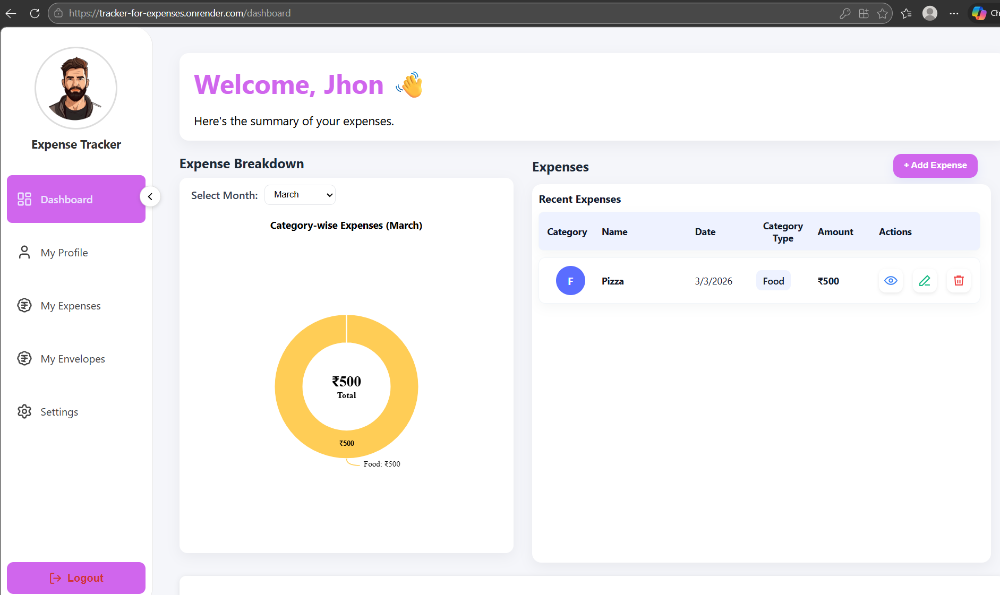
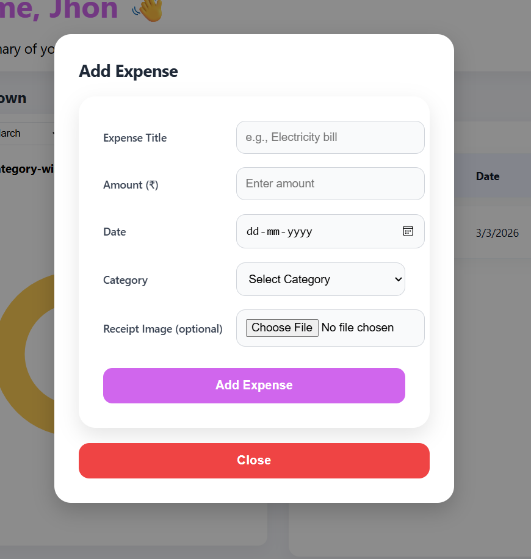
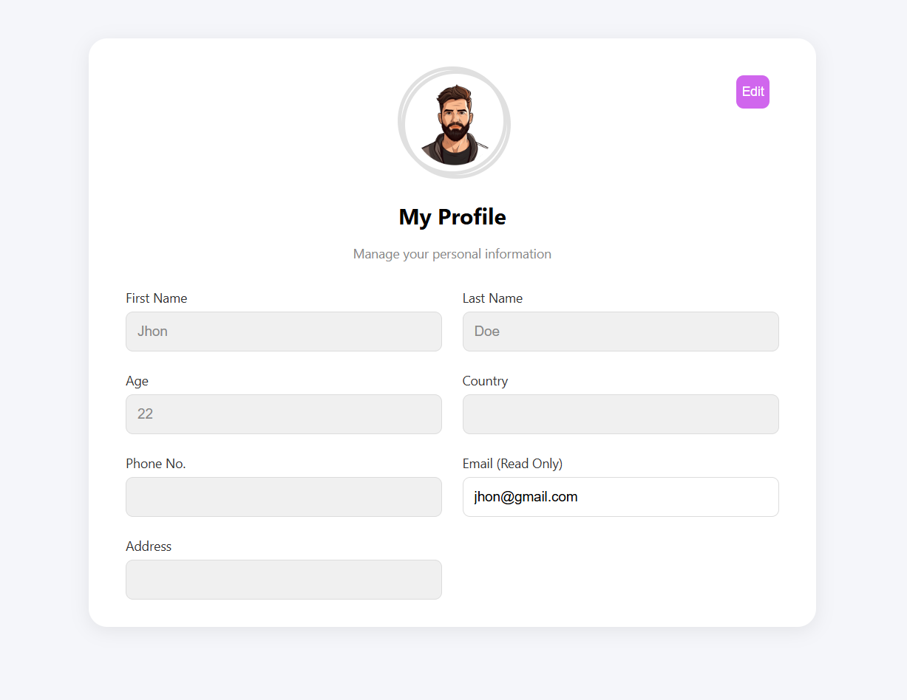

# Expense Tracker


A **full-stack expense tracking web application** that helps users record, manage, and analyze their daily expenses through interactive dashboards and reports.

---

## 💻 Live Demo

Try the application here:

**https://tracker-for-expenses.onrender.com**

---

## 🔑 Demo Credentials

You can log in using the following credentials:

Email: `jhon@gmail.com`  
Password: `Admin@123`

Feel free to explore the application.

---

## ⚠️ Deployment Note

This project is deployed using free-tier cloud services.

- Backend hosted on Render
- Database hosted on MongoDB Atlas
- Images stored using Cloudinary

Because the backend runs on a **free server**, it may go to sleep after inactivity.

The **So request may take around 20–60 seconds** to wake up the server.

---

## 🚀 Tech Stack

### Frontend
- React.js
- CSS
- Axios

### Backend
- Java
- Spring Boot
- JWT Authentication

### Database
- MongoDB

### Cloud Services
- MongoDB Atlas
- Cloudinary
- Render

---

## 🏗️ Architecture

The application follows a **client–server architecture**.

1. The **React frontend** sends API requests to the backend.
2. The **Spring Boot backend** processes requests and applies business logic.
3. **JWT authentication** secures API endpoints.
4. Expense data is stored in **MongoDB Atlas**.
5. Expense images (receipts) are uploaded and stored in **Cloudinary**.

### System Flow

```
React Frontend → Spring Boot REST API → MongoDB Database
                          ↓
                     Cloudinary
```

---

## ✨ Features

- User Signup and Login with JWT authentication
- Add new expenses
- Edit and update existing expenses
- Delete expenses
- Dashboard with charts for expense visualization
- Monthly and yearly expense tracking
- Profile management
- Upload expense receipts/images
- Generate PDF expense reports

---

## 📁 Project Structure

```
Expense_Tracker
│
├── Expense-Tracker-Frontend
│
└── Expense-Tracker-Backend
```

---

## 🔐 Backend Configuration

To run this project locally, update the required credentials in:

```
Expense-Tracker-Backend/src/main/resources/application.properties
```

Add or update the following properties:

```
spring.data.mongodb.uri=your_mongodb_connection_string
jwt.secret=your_jwt_secret

cloudinary.cloud-name=your_cloudinary_cloud_name
cloudinary.api-key=your_cloudinary_api_key
cloudinary.api-secret=your_cloudinary_api_secret
```

You can obtain these credentials from:

- MongoDB Atlas
- Cloudinary

## 🌐 Frontend Environment Variable

Create a `.env` file inside the frontend folder:

```
Expense-Tracker-Frontend/.env
```

Add the backend API URL:

```
REACT_APP_BACKEND_URL=http://localhost:8080
```

When using the deployed backend on Render, this value should point to the deployed backend URL.

## ⚙️ Run Locally

### 1. Run Backend

```
cd Expense-Tracker-Backend
.\mvn spring-boot:run
```

Backend will start on:

```
http://localhost:8080
```

---

### 2. Run Frontend

```
cd Expense-Tracker-Frontend
npm install
npm start
```

Frontend will start on:

```
http://localhost:3000
```

---

## 📊 Screenshots


### Dashboard
<p align="center">
  
</p>

### Add Expense
<p align="center">
  
</p>

### Profile Page
<p align="center">
  
</p>

---

## 📌 Future Improvements

- Build Setting section
- Spending alerts
- Mobile responsive improvements
- Export reports in multiple formats
- Mobile application version